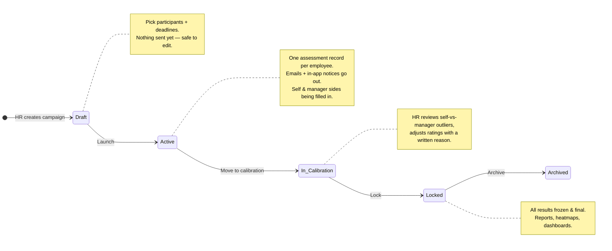
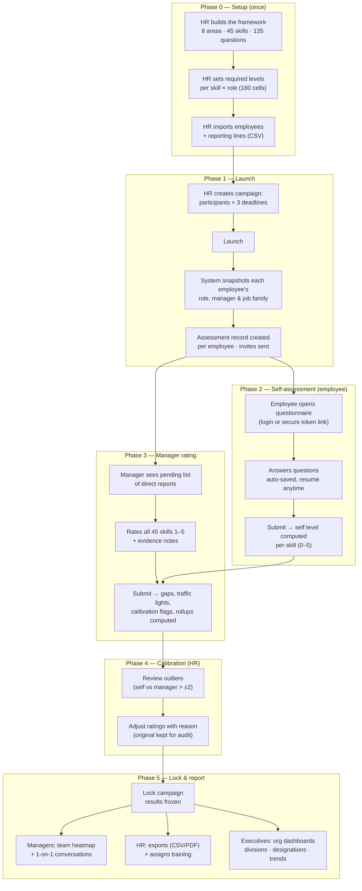
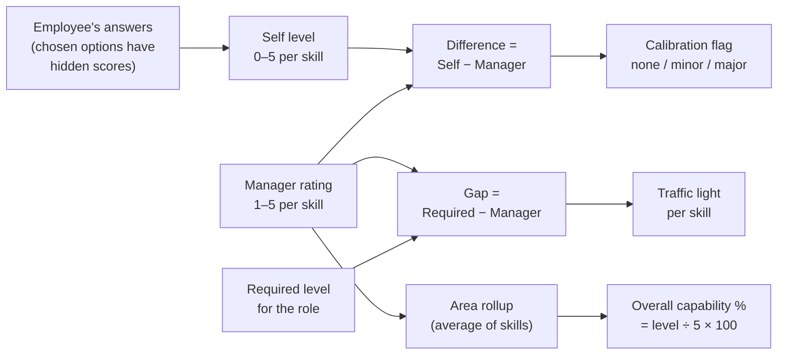
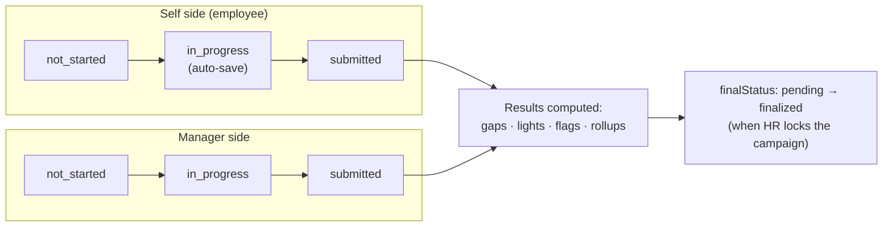

# Caliber — Workflow Map

Visual companion to [`CALIBER_GUIDE.md`](./CALIBER_GUIDE.md). Every flow below
was executed against the live local deployment on **2026-07-14** and passed
(32 unit tests, full live cycle, calibration + lock, 14 screens, CSV export,
6 Playwright e2e tests).

> These diagrams use Mermaid — they render automatically on GitHub and in
> VS Code's markdown preview (`Ctrl+Shift+V`).

---

## 1. The campaign lifecycle — the spine of everything

A **campaign** is one assessment round (e.g. "2026 H1 Assessment"). It is a
strict state machine: each transition is HR-triggered, one-way, and guarded —
the code refuses out-of-order moves (e.g. locking twice). Enforced in
[`campaign.service.ts`](./src/lib/services/campaign.service.ts).

---

## 2. One full cycle, end to end

The master flow across all four roles. Phases 2 and 3 run in parallel for
hundreds of employees at once; everything after them is computed automatically.

---

## 3. How a score becomes a color

The scoring pipeline is pure math in
[`src/lib/domain/scoring/`](./src/lib/domain/scoring/) — no database, fully
unit-tested. **The manager's rating is the official number**; self-assessment
exists only to surface disagreement.

**Traffic lights** (keyed on gap = required − manager):

| Color | Status | Rule |
|---|---|---|
| 🟢 | Strong | gap ≤ 0 — at/above target |
| 🟡 | Developing | 0 < gap ≤ 1 |
| 🟠 | Needs focus | 1 < gap ≤ 2 |
| 🔴 | Critical | gap > 2 |

**Calibration flags** (keyed on |self − manager|): ≤ 1 aligned · ≤ 2 minor
outlier · > 2 **major outlier** (HR reviews these). Thresholds are
HR-configurable in Settings.

---

## 4. One assessment record, two halves

Each employee × campaign gets a single assessment document with two independent
sides. Either side can start first; results only exist once the manager side is
submitted.

---

## 5. Who does what

| Role | Acts in phase | Main screens | Can never |
|---|---|---|---|
| **Employee** | 2 — self-assessment | `/assessment`, token link `/a/…` | See own scores or gaps |
| **Line manager** | 3 — rating · 5 — 1-on-1s | `/team`, `/rate/…` | See other teams; edit framework |
| **HR admin** | 0, 1, 4, 5 — runs the cycle | `/campaigns`, `/framework`, `/audit`… | — (full access, all audited) |
| **Executive** | 5 — consumes results | `/executive` | Edit anything; see individuals |

**Roles are additive** — a division head can be employee + manager + executive
at once and gets the union of permissions. Every state-changing action lands in
the immutable audit log (`/audit`).

---

## 6. Verification run — 2026-07-14

| Flow | How it was exercised | Result |
|---|---|---|
| Scoring math | `npm test` — 32 unit tests | ✓ pass |
| Launch → self → manager → scoring | `npm run cycle` — 14 live assessments | ✓ pass |
| Calibration → adjust → lock | `scripts/verify-lock.ts` — 450 results frozen | ✓ pass |
| Guard rails | Double-lock attempt rejected by state machine | ✓ pass |
| All 14 HR/manager/employee screens | Authenticated HTTP probe — every page 200 | ✓ pass |
| CSV export | Results export incl. calibration note round-trip | ✓ pass |
| Browser journey (login → dashboards → campaign build) | `npm run test:e2e` — 6 Playwright tests | ✓ pass |

Demo logins: `hr@caliber.app / Caliber@123` (demo org, populated dashboards) ·
`hr@caliber.com / Admin@12345` (clean admin). All demo employees:
`Caliber@123`.
